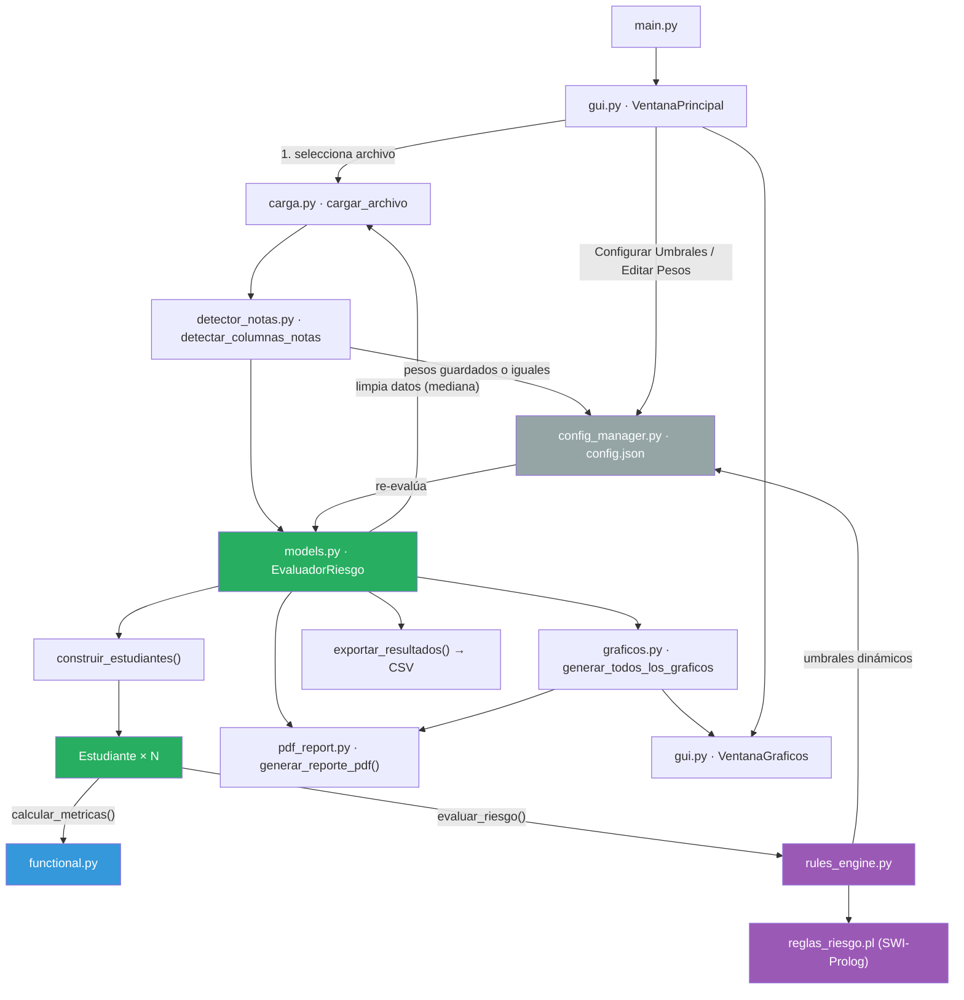
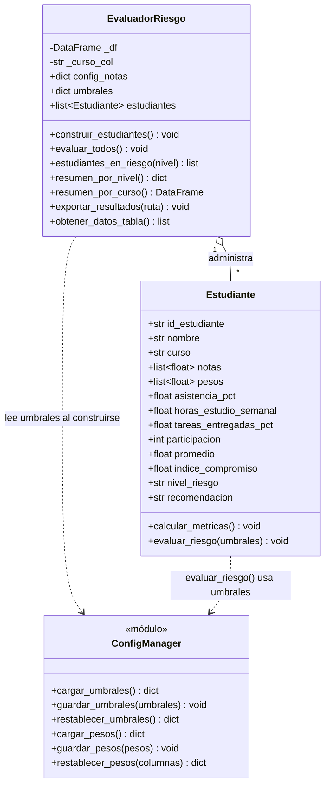
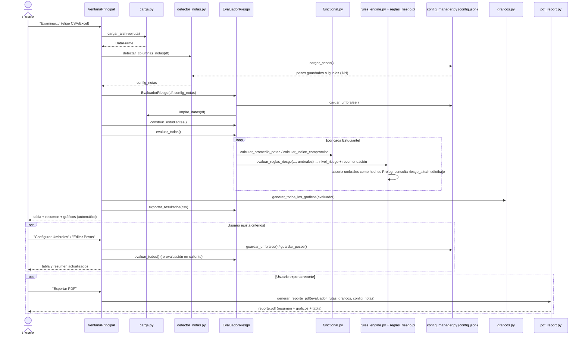

# Análisis Inteligente de Rendimiento Académico Estudiantil

**Curso:** Lenguajes de Programación (100000SI68)

Documentación técnica completa del proyecto: qué hace, cómo está organizado, cómo funciona internamente cada módulo, cómo ejecutarlo de principio a fin, y material de apoyo para la presentación/sustentación.

## Índice

1. [Resumen ejecutivo](#1-resumen-ejecutivo)
2. [Objetivos](#2-objetivos)
3. [Los tres paradigmas](#3-los-tres-paradigmas)
4. [Arquitectura del sistema](#4-arquitectura-del-sistema)
5. [Estructura del proyecto](#5-estructura-del-proyecto)
6. [Flujo de ejecución de principio a fin](#6-flujo-de-ejecución-de-principio-a-fin)
7. [Formato de datos de entrada](#7-formato-de-datos-de-entrada)
8. [Ejemplo completo paso a paso](#8-ejemplo-completo-paso-a-paso)
9. [Módulos en detalle](#9-módulos-en-detalle)
10. [Configuración de umbrales y pesos](#10-configuración-de-umbrales-y-pesos)
11. [Cómo ejecutar el proyecto](#11-cómo-ejecutar-el-proyecto)
12. [Pruebas automatizadas](#12-pruebas-automatizadas)
13. [Pruebas de escala realizadas](#13-pruebas-de-escala-realizadas)
14. [Resumen de reglas de negocio clave](#14-resumen-de-reglas-de-negocio-clave)
15. [Limitaciones y mejoras futuras](#15-limitaciones-y-mejoras-futuras)
16. [Preguntas frecuentes para la sustentación](#16-preguntas-frecuentes-para-la-sustentación)
17. [Guion sugerido para la demo](#17-guion-sugerido-para-la-demo)

---

## 1. Resumen ejecutivo

La aplicación toma un archivo de notas de estudiantes (CSV o Excel), calcula el rendimiento académico de cada uno y **clasifica automáticamente su nivel de riesgo académico** (Alto, Medio o Bajo) combinando promedio de notas, asistencia y compromiso (tareas + participación). El resultado se muestra en una interfaz gráfica de escritorio (Tkinter), se puede exportar a CSV o a un **reporte PDF** completo, y se visualiza mediante 4 gráficos estadísticos generados con matplotlib.

Los umbrales que definen cada nivel de riesgo y los pesos de cada columna de nota **no están fijos en el código**: se guardan en `config.json`, se pueden editar desde la propia interfaz (ventanas "Configurar Umbrales" y "Editar Pesos") y se re-evalúa a todos los estudiantes al instante con los nuevos valores.

**Problema que resuelve:** en cursos con muchos estudiantes es difícil detectar a tiempo quién necesita apoyo académico. El sistema automatiza ese diagnóstico a partir de datos que el docente ya recopila (notas, asistencia, tareas, participación), y permite ajustar los criterios de riesgo a distintos contextos (otra escala de notas, otro reglamento de asistencia) sin tocar código.

**Por qué es relevante para el curso:** es también un ejercicio académico que demuestra tres paradigmas de programación —funcional, **lógico (Prolog)** y orientado a objetos— cooperando sobre el mismo dominio dentro de una única aplicación real, en vez de tres ejemplos aislados.

---

## 2. Objetivos

**Objetivo general:** construir un sistema que, a partir de un archivo de notas, identifique automáticamente a los estudiantes en riesgo académico y comunique el resultado de forma clara, accionable y configurable.

**Objetivos específicos:**

- Calcular métricas de desempeño (promedio ponderado, índice de compromiso) mediante **funciones puras**, sin efectos secundarios ni estado mutable.
- Clasificar el riesgo académico mediante un **motor de reglas declarativas en Prolog** (`reglas_riesgo.pl`), consultado desde Python via pyswip, con reglas inferidas por el motor de SWI-Prolog y umbrales cargados dinámicamente como hechos Prolog.
- Modelar el dominio (`Estudiante`, `EvaluadorRiesgo`) con **programación orientada a objetos**, encapsulando estado y comportamiento.
- Adaptarse automáticamente a distintos formatos de planilla de notas (número variable de exámenes, con o sin columna de curso) sin requerir configuración manual.
- Permitir **personalizar umbrales de riesgo y pesos de notas** desde la GUI, persistiéndolos en `config.json` y re-evaluando en caliente.
- Presentar los resultados de forma visual (tabla filtrable, ordenable y con detalle por estudiante + 4 gráficos) y exportable (CSV y PDF).
- Validar el sistema con una **suite de pruebas automatizadas** (`tests/`, pytest) sobre los módulos puros y el motor de reglas.

---

## 3. Los tres paradigmas

| Paradigma | Dónde vive | Qué resuelve |
|---|---|---|
| **Funcional** | [`src/functional.py`](../functional.py) | Cálculo de promedio ponderado y compromiso mediante funciones puras (`map`/`filter`/`reduce`), sin efectos secundarios. |
| **Lógico** | [`src/rules_engine.py`](../rules_engine.py) + [`reglas_riesgo.pl`](../reglas_riesgo.pl) | Motor de reglas declarativas en **Prolog** (`reglas_riesgo.pl`), consultado desde Python via pyswip. Los umbrales (antes fijos en el `.pl`) ahora se cargan como **hechos dinámicos** desde `config.json` en cada evaluación, así que las reglas se infieren sobre el umbral vigente sin tocar el código Prolog. |
| **Orientado a objetos** | [`src/models.py`](../models.py) | Clases `Estudiante` y `EvaluadorRiesgo` que modelan el dominio y orquestan el flujo. |

La clave de diseño es que **ningún paradigma vive aislado**: `EvaluadorRiesgo` (OOP) orquesta el flujo llamando a `functional.py` para los cálculos y a `rules_engine.py` para la clasificación — cada `Estudiante` delega, no reimplementa. `config_manager.py` (persistencia simple en JSON) alimenta tanto al paradigma lógico (umbrales) como al funcional/OOP (pesos de notas), sin pertenecer él mismo a ninguno de los tres paradigmas: es infraestructura de configuración.

---

## 4. Arquitectura del sistema

### 4.1 Diagrama de componentes



Colores: **verde** = orientado a objetos, **azul** = funcional, **morado** = lógico (Prolog), **gris** = infraestructura de configuración (no es un paradigma del curso, es persistencia compartida).

### 4.2 Diagrama de clases



### 4.3 Diagrama de secuencia (flujo principal + configuración)



---

## 5. Estructura del proyecto

```
analisis-de-rendimiento-estudiantil/
├── main.py                                # Punto de entrada de la aplicación
├── requirements.txt                       # Dependencias (pandas, numpy, matplotlib, openpyxl, Pillow, pyswip, pytest, fpdf2)
├── reglas_riesgo.pl                       # Reglas de riesgo académico en Prolog (umbrales como hechos dinámicos)
├── config.json                            # Umbrales de riesgo y pesos de notas persistidos (editables desde la GUI)
├── rendimiento_estudiantil.csv            # Dataset de ejemplo (220 estudiantes)
├── rendimiento_estudiantil_26.csv         # Dataset con perfiles de riesgo balanceados (60 estudiantes)
├── rendimiento_estudiantil_5000.csv       # Dataset de prueba de escala (5 000 estudiantes)
├── rendimiento_estudiantil_10000.csv      # Dataset de prueba de escala (10 000 estudiantes)
├── *_resultados.csv                       # Salidas generadas automáticamente al procesar cada dataset
├── *-img/                                 # Carpetas de gráficos PNG, una por cada archivo procesado
│   ├── distribucion_riesgo.png
│   ├── promedio_por_curso.png
│   ├── asistencia_vs_promedio.png
│   └── riesgo_por_curso.png
├── src/
│   ├── __init__.py
│   ├── carga.py            # Carga y limpieza de datos (pandas)
│   ├── detector_notas.py   # Detección automática de columnas de notas (usa pesos guardados si existen)
│   ├── functional.py       # Paradigma funcional: cálculos puros
│   ├── rules_engine.py     # Paradigma lógico: puente Python↔Prolog (pyswip), umbrales dinámicos
│   ├── config_manager.py   # Persistencia de umbrales y pesos en config.json
│   ├── models.py            # Paradigma OOP: Estudiante y EvaluadorRiesgo
│   ├── graficos.py          # Generación de visualizaciones (matplotlib)
│   ├── pdf_report.py        # Generación de reportes PDF (fpdf2)
│   ├── gui.py               # Interfaz gráfica (Tkinter)
│   └── docs/                # Esta documentación
└── tests/                   # Suite de pruebas automatizadas (pytest)
    ├── __init__.py
    ├── test_functional.py
    ├── test_detector_notas.py
    ├── test_models.py
    └── test_rules_engine.py
```

> Los datasets `_26`, `_5000` y `_10000` no son datos reales: se generaron sintéticamente para probar el sistema con distintos volúmenes y distribuciones de riesgo (ver [sección 13](#13-pruebas-de-escala-realizadas)).

---

## 6. Flujo de ejecución de principio a fin

```
1. python main.py
2. Se abre la ventana principal (VentanaPrincipal) → tk.Tk() + mainloop()
3. Usuario pulsa "Examinar..." y elige un CSV/Excel
        │
        ▼
4. carga.cargar_archivo(ruta)          → lee el archivo a un DataFrame
        │
        ▼
5. detector_notas.detectar_columnas_notas(df)
        → identifica columnas de nota por prefijo (nota_, examen_, eval_, ...)
        → carga pesos guardados en config.json si coinciden con las columnas
          detectadas; si no, asigna pesos iguales normalizados a 1.0
        → detecta si existe columna "curso"
        │
        ▼
6. models.EvaluadorRiesgo(df, config_notas)
        → limpia datos (carga.limpiar_datos: rellena NaN con la mediana)
        → carga los umbrales de riesgo vigentes (config_manager.cargar_umbrales)
        │
        ▼
7. evaluador.construir_estudiantes()
        → convierte cada fila del DataFrame en un objeto Estudiante
        │
        ▼
8. evaluador.evaluar_todos()
        → por cada Estudiante:
            a) calcular_metricas()   [functional.py: promedio ponderado + índice de compromiso]
            b) evaluar_riesgo(umbrales) [rules_engine.py: carga umbrales como hechos Prolog →
               consulta riesgo_alto/riesgo_medio/riesgo_bajo → nivel_riesgo + recomendación]
        │
        ▼
9. GUI se actualiza:
        - Panel de resumen (totales y barras proporcionales por nivel de riesgo)
        - Tabla de estudiantes (Treeview, coloreada por riesgo, ordenable por columna,
          con doble clic para ver el detalle completo de un estudiante)
        - Combo de cursos poblado dinámicamente
        │
        ▼
10. graficos.generar_todos_los_graficos(evaluador, carpeta)
        → genera 4 PNG en "<nombre_archivo>-img/"
        │
        ▼
11. Exportación automática a "<nombre_archivo>_resultados.csv"
        │
        ▼
12. Se abre automáticamente VentanaGraficos con los 4 gráficos en pestañas
        │
        ▼
13. Usuario puede filtrar (riesgo/curso/estado/búsqueda), ordenar columnas,
    ver el detalle de un estudiante, exportar manualmente a otro CSV o a PDF,
    reabrir la ventana de gráficos, o ajustar umbrales/pesos y re-evaluar
    todo en caliente sin recargar el archivo.
```

---

## 7. Formato de datos de entrada

El archivo de notas (CSV o Excel) debe tener, como mínimo, columnas de nota reconocibles por prefijo. Ejemplo real usado en el proyecto (`rendimiento_estudiantil.csv`):

```
id_estudiante,nombre,curso,ciclo,asistencia_pct,horas_estudio_semanal,tareas_entregadas_pct,participacion,nota_ep1,nota_ep2,nota_final
E0001,María Aguilar,Matemática Discreta,2025-2,93.8,1.6,66.5,4,14.1,13.1,16.2
```

### Columnas reconocidas explícitamente (metadata, nunca se tratan como nota)

`id_estudiante`, `nombre`, `curso`, `ciclo`, `asistencia_pct`, `horas_estudio_semanal`, `tareas_entregadas_pct`, `participacion`

### Columnas de nota (detectadas automáticamente por prefijo)

Cualquier columna cuyo nombre (en minúsculas) empiece con:

`nota_`, `examen_`, `eval_`, `parcial_`, `final_`, `practico_`, `lab_`, `ep`

Ejemplos válidos: `nota_ep1`, `examen_final`, `parcial_1`, `ep2`. El sistema **no limita cuántas** columnas de nota puede haber: se detectan todas y, si no hay pesos personalizados guardados en `config.json` para exactamente esas columnas, se le asigna a cada una un peso igual (`1/N`), ajustando el último peso para que la suma sea exactamente `1.0`. Si el usuario guardó pesos personalizados para ese mismo conjunto de columnas (vía la ventana "Editar Pesos"), esos pesos se reutilizan automáticamente la próxima vez que se cargue un archivo con las mismas columnas.

Si no se detecta ninguna columna de nota, se lanza un `ValueError` explicativo.

Si no existe columna `curso`, todos los estudiantes se agrupan bajo el curso `"General"`.

Los valores nulos en columnas numéricas se rellenan automáticamente con la **mediana** de esa columna (`carga.limpiar_datos`).

---

## 8. Ejemplo completo paso a paso

Para explicar el sistema en vivo conviene mostrar 2-3 filas reales de `rendimiento_estudiantil.csv` calculadas a mano y compararlas contra la tabla de la GUI. Con 3 columnas de nota detectadas (`nota_ep1`, `nota_ep2`, `nota_final`) y sin pesos personalizados guardados, los pesos son `[0.3333, 0.3333, 0.3334]` (el último se ajusta para que la suma dé exactamente 1.0).

**Promedio ponderado:** `Σ(nota_i × peso_i)` — [functional.py:14-21](../functional.py#L14-L21)
**Índice de compromiso:** `(asistencia_pct + tareas_entregadas_pct + participación×20) / 3` — [functional.py:24-38](../functional.py#L24-L38)

Con los umbrales **predeterminados** (`umbral_promedio_alto=10.5`, `umbral_promedio_medio=13.0`, `umbral_asistencia_alto=70`, `umbral_asistencia_medio=80`, `umbral_compromiso_alto=60`, `umbral_compromiso_medio=65`; ver [sección 10](#10-configuración-de-umbrales-y-pesos)):

| Estudiante | Notas (ep1, ep2, final) | Asistencia | Tareas | Particip. | Promedio | Compromiso | Regla aplicada | Riesgo |
|---|---|---|---|---|---|---|---|---|
| E0001 María Aguilar | 14.1, 13.1, 16.2 | 93.8% | 66.5% | 4 | **14.47** | **80.10** | promedio≥13 y asistencia≥80 y compromiso≥65 | **Bajo** |
| E0002 Ricardo López | 12.1, 11.0, 10.9 | 89.2% | 67.6% | 3 | **11.33** | **72.27** | ninguna regla de Alto/Bajo aplica → regla de respaldo | **Medio** |
| E0173 Andrés Vargas | 0.4, 4.0, 3.8 | 61.5% | 65.2% | 2 | **2.73** | **55.57** | promedio<10.5 y asistencia<70 | **Alto** |

Este es exactamente el cálculo que hace el sistema — se puede reproducir con calculadora en pantalla durante la sustentación para demostrar que no hay "caja negra". Si durante la demo se cambian los umbrales desde "Configurar Umbrales" (por ejemplo, subiendo `umbral_asistencia_alto` a 75), Ricardo López pasaría a Alto sin recalcular nada a mano: la re-evaluación es instantánea.

---

## 9. Módulos en detalle

### 9.1 `main.py` — Punto de entrada

Crea la ventana raíz de Tkinter, instancia `VentanaPrincipal` y arranca el bucle de eventos (`root.mainloop()`). No contiene lógica de negocio.

### 9.2 `src/carga.py` — Carga y limpieza de datos

- `cargar_archivo(ruta)`: detecta el formato por extensión (`.csv`, `.xlsx`, `.xls`), lee con pandas y valida que el archivo exista y no esté vacío. Lanza `FileNotFoundError` o `ValueError` según el caso.
- `limpiar_datos(df)`: para cada columna numérica (`float64`/`int64`) con valores nulos, los reemplaza por la **mediana** de esa columna.

### 9.3 `src/detector_notas.py` — Detección automática del sistema de notas

- `PREFIJOS_NOTA`: lista de prefijos reconocidos como columnas de evaluación.
- `COLUMNAS_EXCLUIDAS`: set de columnas que jamás se consideran nota, aunque coincidan con un prefijo.
- `detectar_columnas_notas(df)`: recorre las columnas, aplica la exclusión y el filtro por prefijo. Luego llama a `config_manager.cargar_pesos()`: si hay pesos guardados que cubren **exactamente** las columnas detectadas, los reutiliza; si no, calcula pesos iguales normalizados. También detecta si existe columna `curso`. Retorna un diccionario:
  ```python
  {
      "columnas_nota": [...],
      "pesos": [...],
      "tiene_cursos": bool,
      "curso_col": "curso" | None,
  }
  ```

### 9.4 `src/functional.py` — Paradigma funcional

Funciones **puras** (sin efectos secundarios, mismo input → mismo output):

- `calcular_promedio_notas(notas, pesos)`: producto punto (`np.dot`) entre notas y pesos → promedio ponderado.
- `calcular_indice_compromiso(asistencia, tareas, participacion)`: combina asistencia, % de tareas entregadas y participación (escala 1-5, normalizada ×20) usando `reduce` para sumarlos y dividir entre 3 → índice de 0 a 100.
- `aplicar_a_todos(func, valores)`: envoltorio sobre `map`.
- `filtrar_por_condicion(estudiantes, condicion)`: envoltorio sobre `filter`, usado por `EvaluadorRiesgo.estudiantes_en_riesgo`.

### 9.5 `src/config_manager.py` — Gestión de configuración (umbrales y pesos)

Módulo de infraestructura que centraliza la lectura/escritura de `config.json`, con estructura:

```json
{
  "umbrales_riesgo": { "umbral_promedio_alto": 10.5, "...": "..." },
  "pesos_notas": { "nota_ep1": 0.25, "nota_ep2": 0.25, "nota_final": 0.5 }
}
```

- `UMBRALES_PREDETERMINADOS`: dict con los 6 umbrales de fábrica (los mismos valores que antes estaban fijos en `reglas_riesgo.pl`).
- `cargar_umbrales()` / `guardar_umbrales(umbrales)` / `restablecer_umbrales()`: leen, escriben o resetean la sección `umbrales_riesgo` de `config.json`. Si el archivo no existe o está corrupto, se usan los valores predeterminados sin fallar.
- `cargar_pesos()` / `guardar_pesos(pesos)` / `restablecer_pesos(columnas)`: mismas operaciones para la sección `pesos_notas` (mapa `{nombre_columna: peso}`).
- `_leer_config()` / `_escribir_config(datos)`: helpers privados de I/O sobre el JSON completo (lectura tolerante a errores, escritura con `indent=2` y `ensure_ascii=False` para conservar acentos).

Es el punto de integración entre la GUI (ventanas de configuración), el detector de notas (pesos) y el motor de reglas (umbrales): ninguno de esos módulos sabe leer o escribir el JSON directamente, todos pasan por aquí.

### 9.6 `src/rules_engine.py` — Paradigma lógico (Prolog via pyswip)

`evaluar_reglas_riesgo(id_estudiante, promedio, asistencia, compromiso, umbrales=None)` consulta el motor de inferencia de **SWI-Prolog** a través de `pyswip`. Si no se le pasan `umbrales` explícitamente, los carga con `config_manager.cargar_umbrales()`.

El archivo `reglas_riesgo.pl` define hechos dinámicos y reglas declarativas:

- **Hechos dinámicos por estudiante**: `estudiante_promedio/2`, `estudiante_asistencia/2`, `estudiante_compromiso/2`.
- **Hechos dinámicos de umbral** (nuevos): `umbral_promedio_alto/1`, `umbral_promedio_medio/1`, `umbral_asistencia_alto/1`, `umbral_asistencia_medio/1`, `umbral_compromiso_alto/1`, `umbral_compromiso_medio/1`. Ya **no son constantes fijas** en el `.pl`: `_cargar_umbrales_en_prolog(umbrales)` los retracta y los vuelve a `assertz` en cada llamada, con los valores vigentes en `config.json`.
- **Reglas de inferencia**: `riesgo_alto/1`, `riesgo_medio/1`, `riesgo_bajo/1`, escritas en términos de esos hechos de umbral (por ejemplo `P < UmbralP` en vez de `P < 10.5`).

El flujo es: Python carga los umbrales vigentes como hechos → Python carga los hechos del estudiante en la base de conocimiento de Prolog → el motor de Prolog infiere el nivel de riesgo aplicando unificación y backtracking sobre esos hechos → Python extrae el resultado y limpia con `retractall` los hechos del estudiante (los umbrales quedan y se sobreescriben en la siguiente llamada).

| Condición Prolog (con los umbrales predeterminados) | Resultado |
|---|---|
| `promedio < umbral_promedio_alto (10.5)` y `asistencia < umbral_asistencia_alto (70)` | **Alto** |
| `promedio < umbral_promedio_alto (10.5)` y `compromiso < umbral_compromiso_alto (60)` | **Alto** |
| `promedio < umbral_promedio_medio (13)` y `asistencia < umbral_asistencia_medio (80)` | **Medio** |
| `compromiso < umbral_compromiso_medio (65)` | **Medio** |
| `promedio ≥ umbral_promedio_medio` y `asistencia ≥ umbral_asistencia_medio` y `compromiso ≥ umbral_compromiso_medio` | **Bajo** |
| (ninguna regla anterior aplica) | **Medio** (regla de respaldo en Python) |

`generar_recomendacion(nivel_riesgo)` se mantiene en Python puro (mapeo simple `dict → str`).

### 9.7 `src/models.py` — Paradigma orientado a objetos

**`Estudiante`** (`@dataclass`): almacena los datos crudos de una fila (`id_estudiante`, `nombre`, `curso`, `notas`, `pesos`, `asistencia_pct`, `horas_estudio_semanal`, `tareas_entregadas_pct`, `participacion`) y campos calculados (`promedio`, `indice_compromiso`, `nivel_riesgo`, `recomendacion`, inicializados vacíos con `init=False`).

- `calcular_metricas()`: delega en `functional.py` para llenar `promedio` e `indice_compromiso`.
- `evaluar_riesgo(umbrales=None)`: delega en `rules_engine.py` (pasando los umbrales vigentes) para llenar `nivel_riesgo` y `recomendacion`.

**`EvaluadorRiesgo`**: clase orquestadora que administra la colección completa de estudiantes.

- `__init__(dataframe, config_notas)`: limpia el DataFrame (`limpiar_datos`), guarda `config_notas` y carga `self.umbrales` con `config_manager.cargar_umbrales()`.
- `construir_estudiantes()`: itera el DataFrame fila por fila y crea un objeto `Estudiante` por cada una.
- `evaluar_todos()`: llama `calcular_metricas()` y `evaluar_riesgo(umbrales=self.umbrales)` en cada estudiante. Se puede volver a invocar tras cambiar `self.umbrales` o los pesos en `config_notas` para re-evaluar en caliente.
- `estudiantes_en_riesgo(nivel)`: filtra usando `functional.filtrar_por_condicion`.
- `resumen_por_nivel()`: cuenta estudiantes por nivel de riesgo → `{"Alto": n, "Medio": n, "Bajo": n}`.
- `resumen_por_curso()`: agrega con pandas (`groupby`) promedio, asistencia y total de estudiantes por curso.
- `exportar_resultados(ruta_salida)`: escribe el reporte final a CSV (UTF-8 con BOM, `utf-8-sig`).
- `obtener_datos_tabla()`: retorna una lista de diccionarios lista para poblar la tabla de la GUI.

### 9.8 `src/graficos.py` — Visualizaciones

Usa matplotlib con backend `Agg` (sin ventana propia, solo genera archivos). Todas las funciones reciben un `EvaluadorRiesgo` ya evaluado y una carpeta de salida:

1. **`graficar_distribucion_riesgo`** — barras verticales: cantidad de estudiantes por nivel de riesgo (rojo/naranja/verde).
2. **`graficar_promedio_por_curso`** — barras horizontales: promedio de notas por curso (escala 0-20). Vacío si no hay columna curso.
3. **`graficar_asistencia_vs_promedio`** — dispersión (scatter): asistencia (%) vs. promedio, coloreado por nivel de riesgo.
4. **`graficar_riesgo_por_curso`** — barras apiladas: composición de niveles de riesgo dentro de cada curso (usa `pd.crosstab`). Solo se genera si el dataset tiene columna curso.

`generar_todos_los_graficos(evaluador, carpeta)` crea la carpeta si no existe, ejecuta las 4 funciones y devuelve solo las rutas de los gráficos efectivamente generados (descarta cadenas vacías). Esas mismas rutas se reutilizan luego para incrustar los gráficos en el reporte PDF.

La carpeta de salida se nombra dinámicamente como `<nombre_del_archivo_cargado>-img/` (ver `gui.py`).

### 9.9 `src/pdf_report.py` — Generación de reportes PDF

Usa **fpdf2** para construir un PDF de varias páginas a partir de un `EvaluadorRiesgo` ya evaluado, sin volver a calcular nada.

- **`ReportePDF(FPDF)`**: subclase con `header()`/`footer()` personalizados (marca de agua de título y numeración "Página X/Y") y helpers de estilo (`titulo`, `subtitulo`, `texto`, `linea_separadora`) para mantener una tipografía consistente en todo el documento.
- **`generar_reporte_pdf(evaluador, ruta_salida, ruta_graficos, config_notas)`** construye:
  1. **Portada + resumen ejecutivo**: total de estudiantes, cantidad y porcentaje por nivel de riesgo (coloreado igual que la GUI), columnas de nota detectadas, si hay columna curso, y una tabla de estadísticas por curso (promedio, asistencia, total) si aplica.
  2. **Página(s) de gráficos**: incrusta cada PNG de `ruta_graficos` (las mismas rutas que devuelve `graficar_*`) con su título, saltando de página cuando no queda espacio.
  3. **Tabla de detalle de estudiantes**: una fila por estudiante (ID, nombre, curso, promedio, asistencia, compromiso, riesgo, recomendación truncada), coloreada de fondo según el nivel de riesgo, con encabezado repetido al cambiar de página.
  4. Guarda el PDF en `ruta_salida` y retorna esa ruta.

Se invoca desde `gui.py` (`_exportar_pdf`) cuando el usuario pulsa "Exportar PDF"; si no hay evaluador cargado, el botón permanece deshabilitado.

### 9.10 `src/gui.py` — Interfaz gráfica (Tkinter)

**`VentanaPrincipal`**: ventana principal (1100×750, mínimo 900×600) con:

- **Panel "Cargar archivo de notas"**: botón "Examinar..." que abre un diálogo de selección de CSV/Excel.
- **Panel "Resumen"**: total de estudiantes, una **barra de color proporcional** (`tk.Canvas`) por cada nivel de riesgo con su cantidad y porcentaje, columnas de nota detectadas y si existe columna curso.
- **Panel "Filtrar resultados"**: combos de Riesgo (Todos/Alto/Medio/Bajo), Curso (poblado dinámicamente) y Estado (Todos/Aprobado ≥10.5/Desaprobado <10.5), más un campo de búsqueda por nombre o ID (con `Enter` o botón "Filtrar"). Los filtros se combinan entre sí (AND) y se aplican en memoria sobre `_datos_completos` sin volver a tocar el DataFrame.
- **Tabla de estudiantes** (`ttk.Treeview`): columnas ID, Nombre, Curso, Promedio, Asistencia, Compromiso, Riesgo, Recomendación — con scroll vertical y horizontal, filas coloreadas según el nivel de riesgo mediante tags, **encabezados clicables para ordenar** (asc/desc alternando, con flecha ▲/▼ indicando la columna y dirección activa; columnas numéricas ordenan por valor, el resto alfabéticamente) y **doble clic sobre una fila** para abrir el detalle completo del estudiante.
- **Botones**: "Exportar CSV", "Exportar PDF" (ambos habilitados tras cargar datos), "Configurar Umbrales" (siempre disponible), "Editar Pesos" (habilitado tras cargar datos, porque necesita conocer las columnas de nota) y "Ver Gráficos" (aparece solo si se generaron gráficos).

Flujo al seleccionar archivo (`_seleccionar_archivo`): carga → detecta notas → construye y evalúa estudiantes → actualiza resumen → puebla combo de cursos → aplica filtros → habilita exportar CSV/PDF y editar pesos → **genera gráficos automáticamente** → **exporta CSV automáticamente** (`<nombre>_resultados.csv`) → **abre automáticamente la ventana de gráficos**. Maneja errores de archivo no encontrado / formato inválido con `messagebox.showerror`, y cualquier otra excepción como "error inesperado".

**`VentanaGraficos`**: ventana emergente (`Toplevel`, 900×700) con un `ttk.Notebook` (pestañas), una por cada gráfico generado: "Distribución de Riesgo", "Promedio por Curso", "Asistencia vs Promedio", "Riesgo por Curso". Cada imagen se abre con Pillow (`PIL.Image`/`ImageTk`) y se redimensiona a un ancho máximo de 850px manteniendo proporción.

**`VentanaDetalleEstudiante`** *(nueva)*: ventana emergente (`Toplevel`, 520×520, no redimensionable) que se abre con doble clic sobre una fila de la tabla. Muestra: nombre, ID, curso y nivel de riesgo coloreado; cada nota individual junto con su peso (`nota: valor (peso: XX%)`); las métricas calculadas (promedio ponderado, índice de compromiso, asistencia, horas de estudio semanal, tareas entregadas, participación); y la recomendación completa sin truncar.

**`VentanaConfiguracion`** *(nueva)*: ventana emergente (`Toplevel`, 520×480, modal via `grab_set()`) para editar los 6 umbrales de riesgo. Cada umbral tiene un campo numérico y un texto de ayuda explicando qué controla. Botones: "Restablecer predeterminados" (vuelve a los valores de `UMBRALES_PREDETERMINADOS` y los guarda), "Aplicar" (valida que cada valor esté en `(0, 100]`, guarda con `config_manager.guardar_umbrales`, actualiza `evaluador.umbrales` y **re-evalúa a todos los estudiantes** refrescando tabla y resumen) y "Cancelar".

**`VentanaPesos`** *(nueva)*: ventana emergente (`Toplevel`, 480×420, modal) para editar el peso de cada columna de nota detectada en el archivo actual. Muestra un indicador de suma en vivo (`trace_add` en cada `StringVar`) que se pone verde cuando la suma es ≈1.0 y rojo en caso contrario. Botones: "Iguales (1/n)" (recalcula pesos iguales), "Aplicar" (valida rango `[0, 1]` por peso y que la suma esté a ≤0.01 de 1.0, guarda con `config_manager.guardar_pesos`, actualiza `evaluador.config_notas["pesos"]` y **re-evalúa a todos los estudiantes**) y "Cancelar".

---

## 10. Configuración de umbrales y pesos

Antes, los 6 umbrales de riesgo estaban escritos como literales dentro de `reglas_riesgo.pl` y los pesos de notas siempre eran `1/N`. Ahora ambos son **configuración persistida y editable en caliente**, sin reiniciar la aplicación ni tocar código:

- **Umbrales de riesgo** (`config.json → umbrales_riesgo`): los 6 valores que usan las reglas Prolog (`umbral_promedio_alto`, `umbral_promedio_medio`, `umbral_asistencia_alto`, `umbral_asistencia_medio`, `umbral_compromiso_alto`, `umbral_compromiso_medio`). Editables desde "Configurar Umbrales"; si el archivo no existe o está corrupto, `config_manager` usa `UMBRALES_PREDETERMINADOS` sin lanzar error.
- **Pesos de notas** (`config.json → pesos_notas`): mapa `{columna: peso}` para el archivo de notas actualmente cargado. Editables desde "Editar Pesos"; se reutilizan automáticamente la próxima vez que se cargue un archivo con exactamente las mismas columnas de nota (ver [9.3](#93-srcdetector_notaspy--detección-automática-del-sistema-de-notas)).

**Por qué importa para la sustentación:** demuestra que el paradigma lógico no es una demo estática con constantes quemadas — las reglas Prolog razonan sobre hechos que Python le inyecta en tiempo de ejecución, lo cual es el uso real de un motor de reglas (separar el *conocimiento* — los umbrales — del *mecanismo de inferencia* — las reglas `riesgo_alto/1`, etc.).

Archivo `config.json` de ejemplo (valores predeterminados de fábrica + pesos guardados para un dataset de 3 exámenes):

```json
{
  "umbrales_riesgo": {
    "umbral_promedio_alto": 10.5,
    "umbral_promedio_medio": 13.0,
    "umbral_asistencia_alto": 70.0,
    "umbral_asistencia_medio": 80.0,
    "umbral_compromiso_alto": 60.0,
    "umbral_compromiso_medio": 65.0
  },
  "pesos_notas": {
    "nota_ep1": 0.25,
    "nota_ep2": 0.25,
    "nota_final": 0.5
  }
}
```

---

## 11. Cómo ejecutar el proyecto

### 11.1 Requisitos previos

- Python 3.10+ (el proyecto usa sintaxis moderna de tipos como `list[float]` y `X | None`).
- SWI-Prolog 8.x+ (necesario para pyswip, se instala desde [swi-prolog.org](https://swi-prolog.org)).
- Dependencias de `requirements.txt`: `pandas`, `numpy`, `matplotlib`, `openpyxl`, `Pillow`, `pyswip`, `pytest`, `fpdf2`.
- Tkinter (incluido en la instalación estándar de Python en Windows; en Linux puede requerir el paquete `python3-tk`).

### 11.2 Instalación

```powershell
pip install -r requirements.txt
```

### 11.3 Ejecución

Desde la carpeta raíz del proyecto (`analisis-de-rendimiento-estudiantil/`):

```powershell
python main.py
```

Se abrirá la ventana principal. Pulsar "Examinar...", elegir `rendimiento_estudiantil.csv` (o cualquier CSV/Excel con el formato descrito en la sección 7) y el sistema procesará todo automáticamente: tabla, resumen, gráficos y exportación a CSV. Desde ahí se puede además exportar a PDF, ajustar umbrales/pesos y ver el detalle de cualquier estudiante con doble clic.

### 11.4 Salidas generadas

Al procesar `nombre_archivo.csv`, el sistema genera junto al proyecto:

- `nombre_archivo-img/` con los 4 PNG de gráficos.
- `nombre_archivo_resultados.csv` con el reporte final (id, nombre, curso, promedio, asistencia, índice de compromiso, nivel de riesgo, recomendación).

También se puede exportar manualmente a cualquier ruta con los botones "Exportar CSV" y "Exportar PDF" (este último genera un reporte de varias páginas con resumen, gráficos y tabla completa, ver [9.9](#99-srcpdf_reportpy--generación-de-reportes-pdf)). Los cambios de umbrales/pesos se guardan en `config.json` en la raíz del proyecto.

---

## 12. Pruebas automatizadas

La carpeta `tests/` contiene una suite de **pytest** enfocada en los módulos con lógica pura o fácilmente aislable (funcional, detección de notas, motor de reglas y modelos OOP):

| Archivo | Qué cubre |
|---|---|
| `test_functional.py` | `calcular_promedio_notas` (pesos iguales/desiguales, un solo examen, notas en 0 y 20, lista vacía) y `calcular_indice_compromiso`, además de `aplicar_a_todos` y `filtrar_por_condicion`. |
| `test_detector_notas.py` | Detección de columnas por prefijo (`nota_`, `examen_`, `ep`), que los pesos sumen 1.0, que columnas de metadata nunca se confundan con notas, que se detecte (o no) la columna `curso`, y que se lance `ValueError` si no hay columnas de nota. |
| `test_rules_engine.py` | Las 3 clasificaciones de riesgo (Alto/Medio/Bajo) con los umbrales predeterminados, casos límite exactos (`promedio == 10.5`, `asistencia == 80`), que IDs distintos no colisionen en la base de hechos Prolog, y los textos de `generar_recomendacion` para cada nivel (incluido nivel desconocido). |
| `test_models.py` | `Estudiante.calcular_metricas()` / `evaluar_riesgo()`, `EvaluadorRiesgo.construir_estudiantes()`, `evaluar_todos()`, `resumen_por_nivel()`, `estudiantes_en_riesgo()`, `resumen_por_curso()` y `obtener_datos_tabla()`. |

Ejecutar toda la suite desde la raíz del proyecto:

```powershell
pytest
```

> `test_rules_engine.py` y `test_models.py` ejercitan el puente pyswip real (no hay mocks del motor Prolog), por lo que requieren SWI-Prolog instalado igual que la aplicación — son, de hecho, la forma más simple de verificar que la instalación de Prolog quedó correctamente configurada antes de una demo.

`config_manager.py`, `gui.py`, `pdf_report.py`, `carga.py` y `graficos.py` no tienen pruebas unitarias dedicadas todavía (I/O de archivos, UI de Tkinter y generación de imágenes/PDF son más costosos de testear aisladamente); ver [sección 15](#15-limitaciones-y-mejoras-futuras).

---

## 13. Pruebas de escala realizadas

Para validar que el sistema no solo funciona con datos pequeños sino que se comporta bien con volúmenes reales de una universidad, se generaron y procesaron datasets sintéticos adicionales:

| Dataset | Filas | Propósito |
|---|---|---|
| `rendimiento_estudiantil.csv` | 220 | Dataset base del proyecto (dato "real" de ejemplo). |
| `rendimiento_estudiantil_26.csv` | 60 | Perfiles de riesgo forzados y balanceados (~25% Alto, 40% Medio, 35% Bajo) para verificar visualmente que las 3 categorías se clasifican correctamente. |
| `rendimiento_estudiantil_5000.csv` | 5 000 | Datos con distribución normal realista (notas y asistencia con `random.gauss`), para medir comportamiento a mediana escala. |
| `rendimiento_estudiantil_10000.csv` | 10 000 | Mismo generador, mayor volumen, para observar tiempos de carga/graficado. |

Todos incluyen un ~5-6% de celdas vacías intencionalmente (simulando datos faltantes reales) para ejercitar la imputación por mediana de `carga.limpiar_datos`. Los cuatro se procesaron sin errores y generaron correctamente sus 4 gráficos y su CSV de resultados (`*_resultados.csv`), confirmando que el pipeline (`pandas` vectorizado + `iterrows` para construir estudiantes + una consulta Prolog por estudiante) escala sin cambios de código hasta al menos 10 000 filas.

> Nota honesta para la sustentación: `construir_estudiantes()` usa `DataFrame.iterrows()`, y `evaluar_todos()` hace una consulta Prolog (assertz/query/retractall) por cada estudiante — ambos son O(n) pero con overhead fila-a-fila mayor que una operación vectorizada de pandas. No fue un cuello de botella perceptible hasta 10 000 filas en las pruebas, pero es el punto a optimizar primero si el dataset creciera a cientos de miles de registros (ver [sección 15](#15-limitaciones-y-mejoras-futuras)).

---

## 14. Resumen de reglas de negocio clave

- **Promedio**: suma ponderada de todas las notas detectadas. Los pesos suman exactamente 1.0, y son iguales (`1/N`) salvo que el usuario haya guardado pesos personalizados para ese conjunto exacto de columnas (ver [sección 10](#10-configuración-de-umbrales-y-pesos)).
- **Índice de compromiso**: promedio simple de `asistencia_pct`, `tareas_entregadas_pct` y `participacion × 20` (normalizada a escala 0-100).
- **Aprobación** (solo para el filtro de la GUI, no afecta el nivel de riesgo): promedio ≥ 10.5 = Aprobado.
- **Nivel de riesgo**: se infiere con las reglas Prolog de la [sección 9.6](#96-srcrules_enginepy--paradigma-lógico-prolog-via-pyswip) sobre los umbrales vigentes en `config.json` (predeterminados o editados por el usuario).
- **Datos faltantes**: se imputan con la mediana de la columna correspondiente antes de cualquier cálculo.

---

## 15. Limitaciones y mejoras futuras

Reconocer las limitaciones es parte de una buena sustentación — muestra criterio, no debilidad.

| Limitación actual | Impacto | Mejora futura |
|---|---|---|
| `config.json` es un único archivo global | Todos los cursos/usuarios comparten los mismos umbrales y pesos; no hay perfiles por curso o por docente. | Permitir múltiples perfiles de configuración (por curso, por período) seleccionables desde la GUI. |
| La validación de umbrales solo exige rango `(0, 100]` | Se pueden guardar umbrales lógicamente inconsistentes (ej. `umbral_promedio_alto > umbral_promedio_medio`), lo que produciría clasificaciones contraintuitivas. | Validar la coherencia relativa entre umbrales "alto" y "medio" antes de guardar. |
| Sin pruebas automatizadas para `gui.py`, `pdf_report.py`, `config_manager.py`, `carga.py` y `graficos.py` | Cambios en I/O de archivos, exportación PDF o la interfaz pueden romperse sin que una prueba lo detecte. | Agregar pruebas de integración ligeras (ej. validar que `generar_reporte_pdf` produce un archivo no vacío, que `config_manager` sobrevive a un JSON corrupto). |
| `construir_estudiantes()` usa `iterrows()` fila por fila, y `evaluar_todos()` hace una consulta Prolog por estudiante | Más lento que una operación vectorizada de pandas en datasets muy grandes (100 000+ filas). | Vectorizar la construcción con pandas/numpy, y evaluar por lotes en Prolog en vez de una consulta por estudiante. |
| La imputación por mediana es global por columna | Si el dataset mezcla varios cursos con dificultades distintas, la mediana global puede no ser representativa para todos. | Imputar la mediana por grupo (`groupby("curso")`). |
| La app es de escritorio (Tkinter) | Un docente sin el entorno Python instalado no puede usarla directamente. | Empaquetar con PyInstaller, o migrar a una versión web. |

---

## 16. Preguntas frecuentes para la sustentación

**¿Por qué mediana y no promedio para rellenar datos faltantes?**
La mediana es más robusta a valores atípicos (ej. un 0 por inasistencia justificada no registrada) que distorsionarían un promedio.

**¿Qué pasa si el archivo tiene 10 columnas de nota en vez de 3?**
El detector las reconoce todas automáticamente por prefijo. Si no hay pesos guardados para ese conjunto exacto de 10 columnas, les asigna peso igual `1/10`, ajustando la última para sumar exactamente 1.0. No hay límite de columnas de nota.

**¿Por qué el compromiso combina asistencia, tareas y participación en vez de solo mirar el promedio?**
Un estudiante puede tener buen promedio y aun así estar en riesgo de abandono si deja de asistir o participar — el compromiso captura señales de alerta temprana que el promedio solo no ve (ver reglas 2 y 4 en la [sección 9.6](#96-srcrules_enginepy--paradigma-lógico-prolog-via-pyswip)).

**¿Los umbrales de riesgo están fijos en el código Prolog?**
Ya no. `reglas_riesgo.pl` declara los umbrales como hechos dinámicos (`umbral_promedio_alto/1`, etc.) que Python carga con `assertz` desde `config.json` antes de cada evaluación. Se pueden editar en caliente desde "Configurar Umbrales" sin tocar el `.pl` ni reiniciar la app (ver [sección 10](#10-configuración-de-umbrales-y-pesos)).

**¿Dónde está exactamente cada paradigma?**
Ver la tabla de la [sección 3](#3-los-tres-paradigmas) y el diagrama de componentes de la [sección 4.1](#41-diagrama-de-componentes): `functional.py` (funcional), `rules_engine.py` + `reglas_riesgo.pl` (lógico/Prolog), `models.py` (OOP). `config_manager.py` es infraestructura compartida, no pertenece a ninguno de los tres.

**¿El sistema modifica las notas originales del archivo cargado?**
No. Solo lee el archivo, lo limpia en memoria (rellenando NaN) y genera archivos nuevos (`_resultados.csv`, `*-img/`, PDFs bajo demanda). El CSV/Excel original nunca se sobreescribe.

**¿Qué pasa si subo un archivo sin columna "curso"?**
El sistema no falla: agrupa a todos los estudiantes bajo un curso llamado `"General"` y omite el gráfico de "Riesgo por Curso" (que requiere esa columna).

**¿Cómo se probó que funciona con datos grandes?**
Ver [sección 13](#13-pruebas-de-escala-realizadas) — se generaron y procesaron datasets sintéticos de 5 000 y 10 000 estudiantes sin errores.

**¿Cómo se probó que la lógica es correcta, más allá de la demo visual?**
Con la suite de pytest en `tests/` (ver [sección 12](#12-pruebas-automatizadas)), que cubre casos límite exactos de los umbrales, distintos formatos de columnas de nota y los cálculos puros de promedio/compromiso.

---

## 17. Guion sugerido para la demo

Orden recomendado para una presentación de ~5-7 minutos:

1. **Contexto (30s)** — el problema: detectar a tiempo a estudiantes en riesgo académico.
2. **Los 3 paradigmas (1 min)** — mostrar la tabla de la [sección 3](#3-los-tres-paradigmas) y el diagrama de componentes ([4.1](#41-diagrama-de-componentes)): "cada paradigma resuelve una parte distinta del mismo problema".
3. **Demo en vivo (2-3 min)**:
   - Ejecutar `python main.py`.
   - Cargar `rendimiento_estudiantil.csv`.
   - Señalar el resumen (barras proporcionales por riesgo) y la tabla coloreada.
   - Aplicar un filtro (ej. Riesgo = Alto) y ordenar por una columna para mostrar que responde en vivo.
   - Doble clic sobre un estudiante para mostrar su ventana de detalle.
   - Abrir "Ver Gráficos" y recorrer las 4 pestañas.
4. **El cálculo detrás de un caso (1-2 min)** — usar la tabla de la [sección 8](#8-ejemplo-completo-paso-a-paso): tomar a Andrés Vargas (riesgo Alto) y explicar en la pizarra/diapositiva por qué las reglas lo marcan así.
5. **Configuración en vivo (1 min)** — abrir "Configurar Umbrales", subir `umbral_asistencia_alto`, aplicar y mostrar cómo algún estudiante cambia de nivel al instante; mencionar que esos umbrales son hechos Prolog cargados dinámicamente, no constantes en el código.
6. **Exportables (30s)** — mostrar "Exportar PDF" y abrir brevemente el reporte generado.
7. **Prueba de escala (30s)** — mencionar que el mismo sistema, sin cambios de código, procesó correctamente 10 000 estudiantes ([sección 13](#13-pruebas-de-escala-realizadas)).
8. **Cierre: limitaciones reconocidas (30s)** — mencionar 1-2 puntos de la [sección 15](#15-limitaciones-y-mejoras-futuras) para mostrar visión crítica del propio trabajo.
