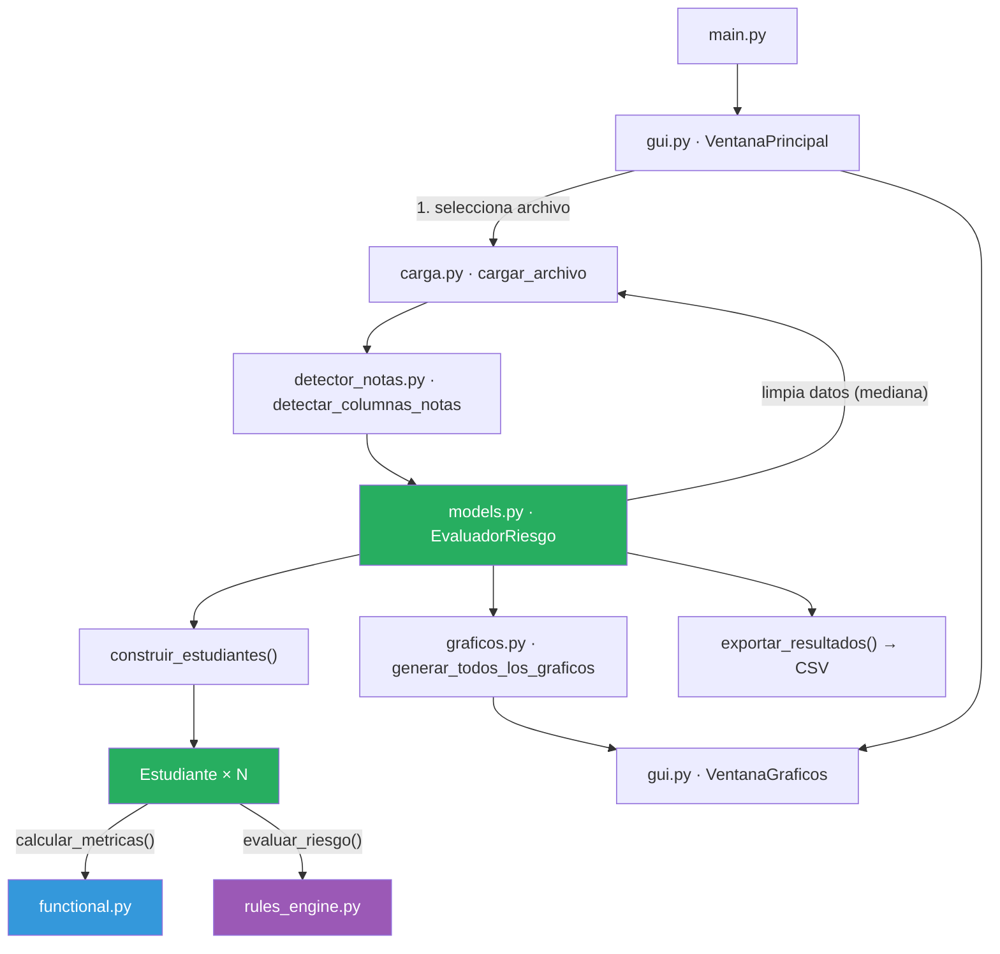
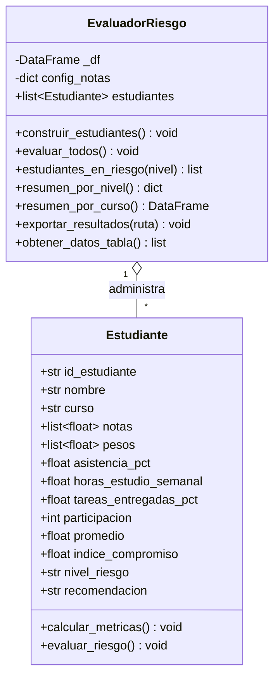
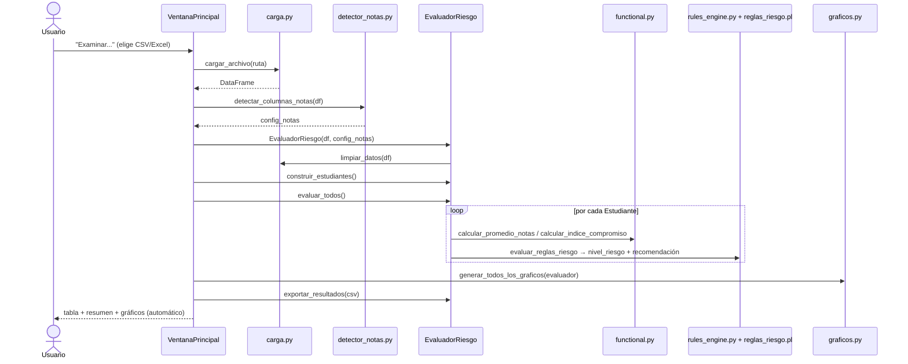

# Análisis Inteligente de Rendimiento Académico Estudiantil

**Curso:** Lenguajes de Programación (100000SI68)

Documentación técnica completa del proyecto: qué hace, cómo está organizado, cómo funciona internamente cada módulo, cómo ejecutarlo de principio a fin, y material de apoyo para la presentación/sustentación.

## Índice

1. [Resumen ejecutivo](#1-resumen-ejecutivo)
2. [Objetivos](#2-objetivos)
3. [Los tres paradigmas](#3-los-tres-paradigmas)
4. [Arquitectura del sistema](#4-arquitectura-del-sistema)
5. [Estructura del proyecto](#5-estructura-del-proyecto)
6. [Flujo de ejecución de principio a fin](#6-flujo-de-ejecución-de-principio-a-fin)
7. [Formato de datos de entrada](#7-formato-de-datos-de-entrada)
8. [Ejemplo completo paso a paso](#8-ejemplo-completo-paso-a-paso)
9. [Módulos en detalle](#9-módulos-en-detalle)
10. [Cómo ejecutar el proyecto](#10-cómo-ejecutar-el-proyecto)
11. [Pruebas de escala realizadas](#11-pruebas-de-escala-realizadas)
12. [Resumen de reglas de negocio clave](#12-resumen-de-reglas-de-negocio-clave)
13. [Limitaciones y mejoras futuras](#13-limitaciones-y-mejoras-futuras)
14. [Preguntas frecuentes para la sustentación](#14-preguntas-frecuentes-para-la-sustentación)
15. [Guion sugerido para la demo](#15-guion-sugerido-para-la-demo)

---

## 1. Resumen ejecutivo

La aplicación toma un archivo de notas de estudiantes (CSV o Excel), calcula el rendimiento académico de cada uno y **clasifica automáticamente su nivel de riesgo académico** (Alto, Medio o Bajo) combinando promedio de notas, asistencia y compromiso (tareas + participación). El resultado se muestra en una interfaz gráfica de escritorio (Tkinter), se puede exportar a CSV y se visualiza mediante 4 gráficos estadísticos generados con matplotlib.

**Problema que resuelve:** en cursos con muchos estudiantes es difícil detectar a tiempo quién necesita apoyo académico. El sistema automatiza ese diagnóstico a partir de datos que el docente ya recopila (notas, asistencia, tareas, participación).

**Por qué es relevante para el curso:** es también un ejercicio académico que demuestra tres paradigmas de programación —funcional, **lógico (Prolog)** y orientado a objetos— cooperando sobre el mismo dominio dentro de una única aplicación real, en vez de tres ejemplos aislados.

---

## 2. Objetivos

**Objetivo general:** construir un sistema que, a partir de un archivo de notas, identifique automáticamente a los estudiantes en riesgo académico y comunique el resultado de forma clara y accionable.

**Objetivos específicos:**

- Calcular métricas de desempeño (promedio ponderado, índice de compromiso) mediante **funciones puras**, sin efectos secundarios ni estado mutable.
- Clasificar el riesgo académico mediante un **motor de reglas declarativas en Prolog** (`reglas_riesgo.pl`), consultado desde Python via pyswip, con reglas inferidas por el motor de SWI-Prolog.
- Modelar el dominio (`Estudiante`, `EvaluadorRiesgo`) con **programación orientada a objetos**, encapsulando estado y comportamiento.
- Adaptarse automáticamente a distintos formatos de planilla de notas (número variable de exámenes, con o sin columna de curso) sin requerir configuración manual.
- Presentar los resultados de forma visual (tabla filtrable + 4 gráficos) y exportable (CSV).

---

## 3. Los tres paradigmas

| Paradigma | Dónde vive | Qué resuelve |
|---|---|---|
| **Funcional** | [`src/functional.py`](../functional.py) | Cálculo de promedio ponderado y compromiso mediante funciones puras (`map`/`filter`/`reduce`), sin efectos secundarios. |
| **Lógico** | [`src/rules_engine.py`](../rules_engine.py) + [`reglas_riesgo.pl`](../reglas_riesgo.pl) | Motor de reglas declarativas en **Prolog** (`reglas_riesgo.pl`), consultado desde Python via pyswip. Las reglas se infieren con el motor de SWI-Prolog. |
| **Orientado a objetos** | [`src/models.py`](../models.py) | Clases `Estudiante` y `EvaluadorRiesgo` que modelan el dominio y orquestan el flujo. |

La clave de diseño es que **ningún paradigma vive aislado**: `EvaluadorRiesgo` (OOP) orquesta el flujo llamando a `functional.py` para los cálculos y a `rules_engine.py` para la clasificación — cada `Estudiante` delega, no reimplementa.

---

## 4. Arquitectura del sistema

### 4.1 Diagrama de componentes



Colores: **verde** = orientado a objetos, **azul** = funcional, **morado** = lógico.

### 4.2 Diagrama de clases



### 4.3 Diagrama de secuencia (flujo principal)



---

## 5. Estructura del proyecto

```
analisis-de-rendimiento-estudiantil/
├── main.py                                # Punto de entrada de la aplicación
├── requirements.txt                       # Dependencias (pandas, numpy, matplotlib, openpyxl, Pillow, pyswip)
├── reglas_riesgo.pl                       # Reglas de riesgo académico en Prolog
├── rendimiento_estudiantil.csv            # Dataset de ejemplo (220 estudiantes)
├── rendimiento_estudiantil_26.csv         # Dataset con perfiles de riesgo balanceados (60 estudiantes)
├── rendimiento_estudiantil_5000.csv       # Dataset de prueba de escala (5 000 estudiantes)
├── rendimiento_estudiantil_10000.csv      # Dataset de prueba de escala (10 000 estudiantes)
├── *_resultados.csv                       # Salidas generadas automáticamente al procesar cada dataset
├── *-img/                                 # Carpetas de gráficos PNG, una por cada archivo procesado
│   ├── distribucion_riesgo.png
│   ├── promedio_por_curso.png
│   ├── asistencia_vs_promedio.png
│   └── riesgo_por_curso.png
└── src/
    ├── __init__.py
    ├── carga.py            # Carga y limpieza de datos (pandas)
    ├── detector_notas.py   # Detección automática de columnas de notas
    ├── functional.py       # Paradigma funcional: cálculos puros
    ├── rules_engine.py     # Paradigma lógico: puente Python↔Prolog (pyswip)
    ├── models.py            # Paradigma OOP: Estudiante y EvaluadorRiesgo
    ├── graficos.py          # Generación de visualizaciones (matplotlib)
    ├── gui.py               # Interfaz gráfica (Tkinter)
    └── docs/                # Esta documentación
```

> Los datasets `_26`, `_5000` y `_10000` no son datos reales: se generaron sintéticamente para probar el sistema con distintos volúmenes y distribuciones de riesgo (ver [sección 11](#11-pruebas-de-escala-realizadas)).

---

## 6. Flujo de ejecución de principio a fin

```
1. python main.py
2. Se abre la ventana principal (VentanaPrincipal) → tk.Tk() + mainloop()
3. Usuario pulsa "Examinar..." y elige un CSV/Excel
        │
        ▼
4. carga.cargar_archivo(ruta)          → lee el archivo a un DataFrame
        │
        ▼
5. detector_notas.detectar_columnas_notas(df)
        → identifica columnas de nota por prefijo (nota_, examen_, eval_, ...)
        → calcula pesos iguales normalizados a 1.0
        → detecta si existe columna "curso"
        │
        ▼
6. models.EvaluadorRiesgo(df, config_notas)
        → limpia datos (carga.limpiar_datos: rellena NaN con la mediana)
        │
        ▼
7. evaluador.construir_estudiantes()
        → convierte cada fila del DataFrame en un objeto Estudiante
        │
        ▼
8. evaluador.evaluar_todos()
        → por cada Estudiante:
            a) calcular_metricas()   [functional.py: promedio ponderado + índice de compromiso]
            b) evaluar_riesgo()      [rules_engine.py: motor de reglas → nivel_riesgo + recomendación]
        │
        ▼
9. GUI se actualiza:
        - Panel de resumen (totales por nivel de riesgo)
        - Tabla de estudiantes (Treeview, coloreada por riesgo)
        - Combo de cursos poblado dinámicamente
        │
        ▼
10. graficos.generar_todos_los_graficos(evaluador, carpeta)
        → genera 4 PNG en "<nombre_archivo>-img/"
        │
        ▼
11. Exportación automática a "<nombre_archivo>_resultados.csv"
        │
        ▼
12. Se abre automáticamente VentanaGraficos con los 4 gráficos en pestañas
        │
        ▼
13. Usuario puede filtrar (riesgo/curso/estado/búsqueda), exportar
    manualmente a otro CSV, o reabrir la ventana de gráficos.
```

---

## 7. Formato de datos de entrada

El archivo de notas (CSV o Excel) debe tener, como mínimo, columnas de nota reconocibles por prefijo. Ejemplo real usado en el proyecto (`rendimiento_estudiantil.csv`):

```
id_estudiante,nombre,curso,ciclo,asistencia_pct,horas_estudio_semanal,tareas_entregadas_pct,participacion,nota_ep1,nota_ep2,nota_final
E0001,María Aguilar,Matemática Discreta,2025-2,93.8,1.6,66.5,4,14.1,13.1,16.2
```

### Columnas reconocidas explícitamente (metadata, nunca se tratan como nota)

`id_estudiante`, `nombre`, `curso`, `ciclo`, `asistencia_pct`, `horas_estudio_semanal`, `tareas_entregadas_pct`, `participacion`

### Columnas de nota (detectadas automáticamente por prefijo)

Cualquier columna cuyo nombre (en minúsculas) empiece con:

`nota_`, `examen_`, `eval_`, `parcial_`, `final_`, `practico_`, `lab_`, `ep`

Ejemplos válidos: `nota_ep1`, `examen_final`, `parcial_1`, `ep2`. El sistema **no limita cuántas** columnas de nota puede haber: se detectan todas y a cada una se le asigna un peso igual (`1/N`), ajustando el último peso para que la suma sea exactamente `1.0`.

Si no se detecta ninguna columna de nota, se lanza un `ValueError` explicativo.

Si no existe columna `curso`, todos los estudiantes se agrupan bajo el curso `"General"`.

Los valores nulos en columnas numéricas se rellenan automáticamente con la **mediana** de esa columna (`carga.limpiar_datos`).

---

## 8. Ejemplo completo paso a paso

Para explicar el sistema en vivo conviene mostrar 2-3 filas reales de `rendimiento_estudiantil.csv` calculadas a mano y compararlas contra la tabla de la GUI. Con 3 columnas de nota detectadas (`nota_ep1`, `nota_ep2`, `nota_final`), los pesos son `[0.3333, 0.3333, 0.3334]` (el último se ajusta para que la suma dé exactamente 1.0).

**Promedio ponderado:** `Σ(nota_i × peso_i)` — [functional.py:14-21](../functional.py#L14-L21)
**Índice de compromiso:** `(asistencia_pct + tareas_entregadas_pct + participación×20) / 3` — [functional.py:24-38](../functional.py#L24-L38)

| Estudiante | Notas (ep1, ep2, final) | Asistencia | Tareas | Particip. | Promedio | Compromiso | Regla aplicada | Riesgo |
|---|---|---|---|---|---|---|---|---|
| E0001 María Aguilar | 14.1, 13.1, 16.2 | 93.8% | 66.5% | 4 | **14.47** | **80.10** | promedio≥13 y asistencia≥80 y compromiso≥65 | **Bajo** |
| E0002 Ricardo López | 12.1, 11.0, 10.9 | 89.2% | 67.6% | 3 | **11.33** | **72.27** | ninguna regla de Alto/Bajo aplica → regla de respaldo | **Medio** |
| E0173 Andrés Vargas | 0.4, 4.0, 3.8 | 61.5% | 65.2% | 2 | **2.73** | **55.57** | promedio<10.5 y asistencia<70 | **Alto** |

Este es exactamente el cálculo que hace el sistema — se puede reproducir con calculadora en pantalla durante la sustentación para demostrar que no hay "caja negra".

---

## 9. Módulos en detalle

### 9.1 `main.py` — Punto de entrada

Crea la ventana raíz de Tkinter, instancia `VentanaPrincipal` y arranca el bucle de eventos (`root.mainloop()`). No contiene lógica de negocio.

### 9.2 `src/carga.py` — Carga y limpieza de datos

- `cargar_archivo(ruta)`: detecta el formato por extensión (`.csv`, `.xlsx`, `.xls`), lee con pandas y valida que el archivo exista y no esté vacío. Lanza `FileNotFoundError` o `ValueError` según el caso.
- `limpiar_datos(df)`: para cada columna numérica (`float64`/`int64`) con valores nulos, los reemplaza por la **mediana** de esa columna.

### 9.3 `src/detector_notas.py` — Detección automática del sistema de notas

- `PREFIJOS_NOTA`: lista de prefijos reconocidos como columnas de evaluación.
- `COLUMNAS_EXCLUIDAS`: set de columnas que jamás se consideran nota, aunque coincidan con un prefijo.
- `detectar_columnas_notas(df)`: recorre las columnas, aplica la exclusión y el filtro por prefijo, calcula pesos iguales normalizados, y detecta si existe columna `curso`. Retorna un diccionario:
  ```python
  {
      "columnas_nota": [...],
      "pesos": [...],
      "tiene_cursos": bool,
      "curso_col": "curso" | None,
  }
  ```

### 9.4 `src/functional.py` — Paradigma funcional

Funciones **puras** (sin efectos secundarios, mismo input → mismo output):

- `calcular_promedio_notas(notas, pesos)`: producto punto (`np.dot`) entre notas y pesos → promedio ponderado.
- `calcular_indice_compromiso(asistencia, tareas, participacion)`: combina asistencia, % de tareas entregadas y participación (escala 1-5, normalizada ×20) usando `reduce` para sumarlos y dividir entre 3 → índice de 0 a 100.
- `aplicar_a_todos(func, valores)`: envoltorio sobre `map`.
- `filtrar_por_condicion(estudiantes, condicion)`: envoltorio sobre `filter`, usado por `EvaluadorRiesgo.estudiantes_en_riesgo`.

### 9.5 `src/rules_engine.py` — Paradigma lógico (Prolog via pyswip)

`evaluar_reglas_riesgo(id_estudiante, promedio, asistencia, compromiso)` consulta el motor de inferencia de **SWI-Prolog** a través de `pyswip`.

El archivo `reglas_riesgo.pl` define hechos dinámicos y reglas declarativas:

- **Hechos dinámicos**: `estudiante_promedio/2`, `estudiante_asistencia/2`, `estudiante_compromiso/2`
- **Reglas de inferencia**: `riesgo_alto/1`, `riesgo_medio/1`, `riesgo_bajo/1`

El flujo es: Python carga los hechos del estudiante en la base de conocimiento de Prolog → el motor de Prolog infiere el nivel de riesgo aplicando unificación y backtracking → Python extrae el resultado y limpia los hechos con `retractall`.

| Condición Prolog | Resultado |
|---|---|
| `promedio < 10.5` y `asistencia < 70` | **Alto** |
| `promedio < 10.5` y `compromiso < 60` | **Alto** |
| `promedio < 13` y `asistencia < 80` | **Medio** |
| `compromiso < 65` | **Medio** |
| `promedio >= 13` y `asistencia >= 80` y `compromiso >= 65` | **Bajo** |

`generar_recomendacion(nivel_riesgo)` se mantiene en Python puro (mapeo simple `dict → str`).

### 9.6 `src/models.py` — Paradigma orientado a objetos

**`Estudiante`** (`@dataclass`): almacena los datos crudos de una fila (`id_estudiante`, `nombre`, `curso`, `notas`, `pesos`, `asistencia_pct`, `horas_estudio_semanal`, `tareas_entregadas_pct`, `participacion`) y campos calculados (`promedio`, `indice_compromiso`, `nivel_riesgo`, `recomendacion`, inicializados vacíos con `init=False`).

- `calcular_metricas()`: delega en `functional.py` para llenar `promedio` e `indice_compromiso`.
- `evaluar_riesgo()`: delega en `rules_engine.py` para llenar `nivel_riesgo` y `recomendacion`.

**`EvaluadorRiesgo`**: clase orquestadora que administra la colección completa de estudiantes.

- `__init__(dataframe, config_notas)`: limpia el DataFrame (`limpiar_datos`) y guarda la configuración de notas.
- `construir_estudiantes()`: itera el DataFrame fila por fila y crea un objeto `Estudiante` por cada una.
- `evaluar_todos()`: llama `calcular_metricas()` y `evaluar_riesgo()` en cada estudiante.
- `estudiantes_en_riesgo(nivel)`: filtra usando `functional.filtrar_por_condicion`.
- `resumen_por_nivel()`: cuenta estudiantes por nivel de riesgo → `{"Alto": n, "Medio": n, "Bajo": n}`.
- `resumen_por_curso()`: agrega con pandas (`groupby`) promedio, asistencia y total de estudiantes por curso.
- `exportar_resultados(ruta_salida)`: escribe el reporte final a CSV (UTF-8 con BOM, `utf-8-sig`).
- `obtener_datos_tabla()`: retorna una lista de diccionarios lista para poblar la tabla de la GUI.

### 9.7 `src/graficos.py` — Visualizaciones

Usa matplotlib con backend `Agg` (sin ventana propia, solo genera archivos). Todas las funciones reciben un `EvaluadorRiesgo` ya evaluado y una carpeta de salida:

1. **`graficar_distribucion_riesgo`** — barras verticales: cantidad de estudiantes por nivel de riesgo (rojo/naranja/verde).
2. **`graficar_promedio_por_curso`** — barras horizontales: promedio de notas por curso (escala 0-20). Vacío si no hay columna curso.
3. **`graficar_asistencia_vs_promedio`** — dispersión (scatter): asistencia (%) vs. promedio, coloreado por nivel de riesgo.
4. **`graficar_riesgo_por_curso`** — barras apiladas: composición de niveles de riesgo dentro de cada curso (usa `pd.crosstab`). Solo se genera si el dataset tiene columna curso.

`generar_todos_los_graficos(evaluador, carpeta)` crea la carpeta si no existe, ejecuta las 4 funciones y devuelve solo las rutas de los gráficos efectivamente generados (descarta cadenas vacías).

La carpeta de salida se nombra dinámicamente como `<nombre_del_archivo_cargado>-img/` (ver `gui.py`).

### 9.8 `src/gui.py` — Interfaz gráfica (Tkinter)

**`VentanaPrincipal`**: ventana principal (1100×750, mínimo 900×600) con:

- **Panel "Cargar archivo"**: botón "Examinar..." que abre un diálogo de selección de CSV/Excel.
- **Panel "Resumen"**: totales de estudiantes y desglose por nivel de riesgo (con color), columnas de nota detectadas y si existe columna curso.
- **Panel "Filtrar resultados"**: combos de Riesgo (Todos/Alto/Medio/Bajo), Curso (poblado dinámicamente) y Estado (Todos/Aprobado ≥10.5/Desaprobado <10.5), más un campo de búsqueda por nombre o ID. Los filtros se combinan entre sí (AND) y se aplican en memoria sobre `_datos_completos` sin volver a tocar el DataFrame.
- **Tabla de estudiantes** (`ttk.Treeview`): columnas ID, Nombre, Curso, Promedio, Asistencia, Compromiso, Riesgo — con scroll vertical y horizontal, y filas coloreadas según el nivel de riesgo mediante tags.
- **Botones**: "Exportar CSV" (habilitado tras cargar datos) y "Ver Gráficos" (aparece solo si se generaron gráficos).

Flujo al seleccionar archivo (`_seleccionar_archivo`): carga → detecta notas → construye y evalúa estudiantes → actualiza resumen → puebla combo de cursos → aplica filtros → habilita exportar → **genera gráficos automáticamente** → **exporta CSV automáticamente** (`<nombre>_resultados.csv`) → **abre automáticamente la ventana de gráficos**. Maneja errores de archivo no encontrado / formato inválido con `messagebox.showerror`, y cualquier otra excepción como "error inesperado".

**`VentanaGraficos`**: ventana emergente (`Toplevel`, 900×700) con un `ttk.Notebook` (pestañas), una por cada gráfico generado: "Distribución de Riesgo", "Promedio por Curso", "Asistencia vs Promedio", "Riesgo por Curso". Cada imagen se abre con Pillow (`PIL.Image`/`ImageTk`) y se redimensiona a un ancho máximo de 850px manteniendo proporción.

---

## 10. Cómo ejecutar el proyecto

### 10.1 Requisitos previos

- Python 3.10+ (el proyecto usa sintaxis moderna de tipos como `list[float]` y `X | None`).
- SWI-Prolog 8.x+ (necesario para pyswip, se instala desde [swi-prolog.org](https://swi-prolog.org)).
- Dependencias de `requirements.txt`: `pandas`, `numpy`, `matplotlib`, `openpyxl`, `Pillow`, `pyswip`.
- Tkinter (incluido en la instalación estándar de Python en Windows; en Linux puede requerir el paquete `python3-tk`).

### 10.2 Instalación

```powershell
pip install -r requirements.txt
```

### 10.3 Ejecución

Desde la carpeta raíz del proyecto (`analisis-de-rendimiento-estudiantil/`):

```powershell
python main.py
```

Se abrirá la ventana principal. Pulsar "Examinar...", elegir `rendimiento_estudiantil.csv` (o cualquier CSV/Excel con el formato descrito en la sección 7) y el sistema procesará todo automáticamente: tabla, resumen, gráficos y exportación.

### 10.4 Salidas generadas

Al procesar `nombre_archivo.csv`, el sistema genera junto al proyecto:

- `nombre_archivo-img/` con los 4 PNG de gráficos.
- `nombre_archivo_resultados.csv` con el reporte final (id, nombre, curso, promedio, asistencia, índice de compromiso, nivel de riesgo, recomendación).

También se puede exportar manualmente a cualquier ruta con el botón "Exportar CSV".

---

## 11. Pruebas de escala realizadas

Para validar que el sistema no solo funciona con datos pequeños sino que se comporta bien con volúmenes reales de una universidad, se generaron y procesaron datasets sintéticos adicionales:

| Dataset | Filas | Propósito |
|---|---|---|
| `rendimiento_estudiantil.csv` | 220 | Dataset base del proyecto (dato "real" de ejemplo). |
| `rendimiento_estudiantil_26.csv` | 60 | Perfiles de riesgo forzados y balanceados (~25% Alto, 40% Medio, 35% Bajo) para verificar visualmente que las 3 categorías se clasifican correctamente. |
| `rendimiento_estudiantil_5000.csv` | 5 000 | Datos con distribución normal realista (notas y asistencia con `random.gauss`), para medir comportamiento a mediana escala. |
| `rendimiento_estudiantil_10000.csv` | 10 000 | Mismo generador, mayor volumen, para observar tiempos de carga/graficado. |

Todos incluyen un ~5-6% de celdas vacías intencionalmente (simulando datos faltantes reales) para ejercitar la imputación por mediana de `carga.limpiar_datos`. Los cuatro se procesaron sin errores y generaron correctamente sus 4 gráficos y su CSV de resultados (`*_resultados.csv`), confirmando que el pipeline (`pandas` vectorizado + `iterrows` para construir estudiantes) escala sin cambios de código hasta al menos 10 000 filas.

> Nota honesta para la sustentación: `construir_estudiantes()` usa `DataFrame.iterrows()`, que es O(n) pero más lento fila-a-fila que una operación vectorizada de pandas. No fue un cuello de botella perceptible hasta 10 000 filas en las pruebas, pero es el punto a optimizar primero si el dataset creciera a cientos de miles de registros (ver [sección 13](#13-limitaciones-y-mejoras-futuras)).

---

## 12. Resumen de reglas de negocio clave

- **Promedio**: suma ponderada de todas las notas detectadas, con pesos iguales que suman exactamente 1.0.
- **Índice de compromiso**: promedio simple de `asistencia_pct`, `tareas_entregadas_pct` y `participacion × 20` (normalizada a escala 0-100).
- **Aprobación** (solo para el filtro de la GUI, no afecta el nivel de riesgo): promedio ≥ 10.5 = Aprobado.
- **Nivel de riesgo**: ver tabla de reglas en la [sección 9.5](#95-srcrules_enginepy--paradigma-lógico-prolog-via-pyswip).
- **Datos faltantes**: se imputan con la mediana de la columna correspondiente antes de cualquier cálculo.

---

## 13. Limitaciones y mejoras futuras

Reconocer las limitaciones es parte de una buena sustentación — muestra criterio, no debilidad.

| Limitación actual | Impacto | Mejora futura |
|---|---|---|
| Pesos de notas siempre iguales (`1/N`) | No se puede dar más peso a un examen final que a una práctica. | Permitir pesos configurables desde la GUI. |
| Umbrales de riesgo fijos en `reglas_riesgo.pl` (10.5, 70, 80, etc.) | No se adaptan a distintos sistemas de calificación (p. ej. escala 0-100 o 0-4). | Externalizar los umbrales a un archivo de configuración o parametrizar las reglas Prolog. |
| Sin pruebas automatizadas (no hay carpeta `tests/`) | Los cambios futuros pueden romper reglas sin que nadie lo note de inmediato. | Agregar pruebas unitarias para `functional.py` y `rules_engine.py`, que son funciones puras fáciles de testear. |
| `construir_estudiantes()` usa `iterrows()` fila por fila | Más lento que una operación vectorizada de pandas en datasets muy grandes (100 000+ filas). | Vectorizar la construcción usando operaciones de pandas/numpy directamente sobre el DataFrame. |
| La imputación por mediana es global por columna | Si el dataset mezcla varios cursos con dificultades distintas, la mediana global puede no ser representativa para todos. | Imputar la mediana por grupo (`groupby("curso")`). |
| La app es de escritorio (Tkinter) | Un docente sin el entorno Python instalado no puede usarla directamente. | Empaquetar con PyInstaller, o migrar a una versión web. |

---

## 14. Preguntas frecuentes para la sustentación

**¿Por qué mediana y no promedio para rellenar datos faltantes?**
La mediana es más robusta a valores atípicos (ej. un 0 por inasistencia justificada no registrada) que distorsionarían un promedio.

**¿Qué pasa si el archivo tiene 10 columnas de nota en vez de 3?**
El detector las reconoce todas automáticamente por prefijo y les asigna peso igual `1/10`, ajustando la última para sumar exactamente 1.0. No hay límite de columnas de nota.

**¿Por qué el compromiso combina asistencia, tareas y participación en vez de solo mirar el promedio?**
Un estudiante puede tener buen promedio y aun así estar en riesgo de abandono si deja de asistir o participar — el compromiso captura señales de alerta temprana que el promedio solo no ve (ver reglas 2 y 4 en la [sección 9.5](#95-srcrules_enginepy--paradigma-lógico-prolog-via-pyswip)).

**¿Dónde está exactamente cada paradigma?**
Ver la tabla de la [sección 3](#3-los-tres-paradigmas) y el diagrama de componentes de la [sección 4.1](#41-diagrama-de-componentes): `functional.py` (funcional), `rules_engine.py` + `reglas_riesgo.pl` (lógico/Prolog), `models.py` (OOP).

**¿El sistema modifica las notas originales del archivo cargado?**
No. Solo lee el archivo, lo limpia en memoria (rellenando NaN) y genera archivos nuevos (`_resultados.csv`, `*-img/`). El CSV/Excel original nunca se sobreescribe.

**¿Qué pasa si subo un archivo sin columna "curso"?**
El sistema no falla: agrupa a todos los estudiantes bajo un curso llamado `"General"` y omite el gráfico de "Riesgo por Curso" (que requiere esa columna).

**¿Cómo se probó que funciona con datos grandes?**
Ver [sección 11](#11-pruebas-de-escala-realizadas) — se generaron y procesaron datasets sintéticos de 5 000 y 10 000 estudiantes sin errores.

---

## 15. Guion sugerido para la demo

Orden recomendado para una presentación de ~5-7 minutos:

1. **Contexto (30s)** — el problema: detectar a tiempo a estudiantes en riesgo académico.
2. **Los 3 paradigmas (1 min)** — mostrar la tabla de la [sección 3](#3-los-tres-paradigmas) y el diagrama de componentes ([4.1](#41-diagrama-de-componentes)): "cada paradigma resuelve una parte distinta del mismo problema".
3. **Demo en vivo (2-3 min)**:
   - Ejecutar `python main.py`.
   - Cargar `rendimiento_estudiantil.csv`.
   - Señalar el resumen (totales por riesgo) y la tabla coloreada.
   - Aplicar un filtro (ej. Riesgo = Alto) para mostrar que responde en vivo.
   - Abrir "Ver Gráficos" y recorrer las 4 pestañas.
4. **El cálculo detrás de un caso (1-2 min)** — usar la tabla de la [sección 8](#8-ejemplo-completo-paso-a-paso): tomar a Andrés Vargas (riesgo Alto) y explicar en la pizarra/diapositiva por qué las reglas lo marcan así.
5. **Prueba de escala (30s)** — mencionar que el mismo sistema, sin cambios de código, procesó correctamente 10 000 estudiantes ([sección 11](#11-pruebas-de-escala-realizadas)).
6. **Cierre: limitaciones reconocidas (30s)** — mencionar 1-2 puntos de la [sección 13](#13-limitaciones-y-mejoras-futuras) para mostrar visión crítica del propio trabajo.
